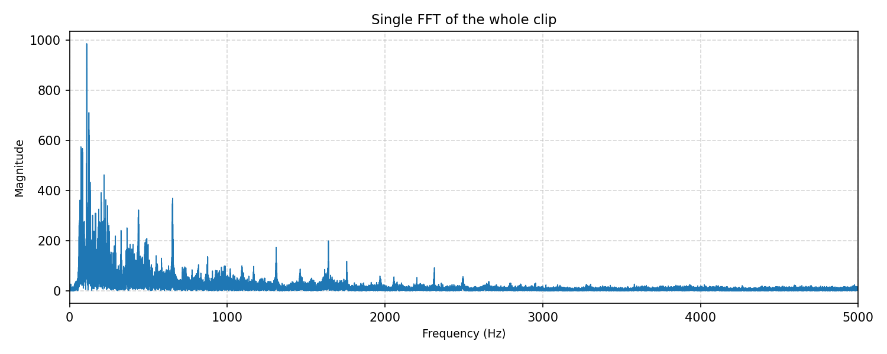
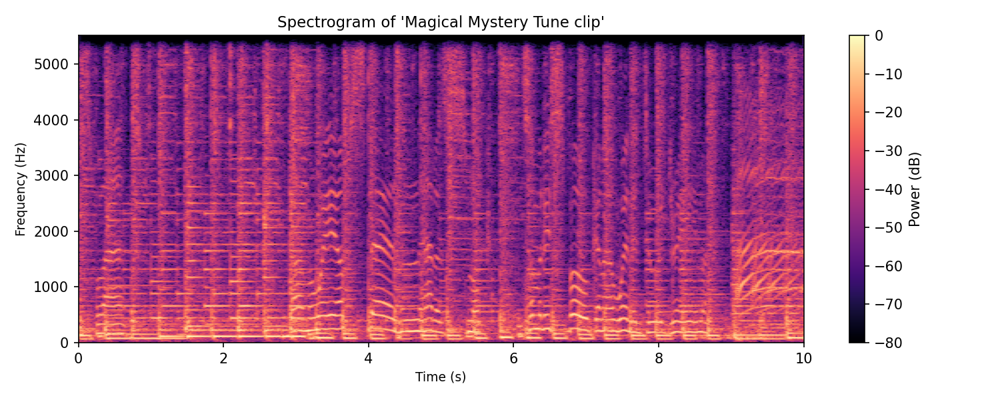
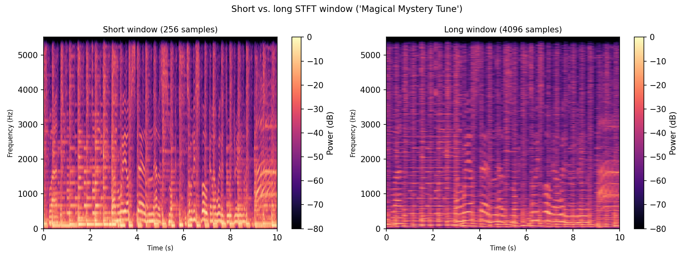
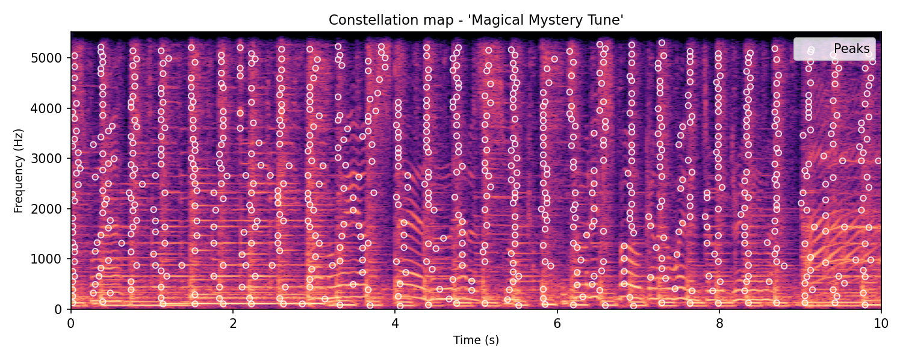
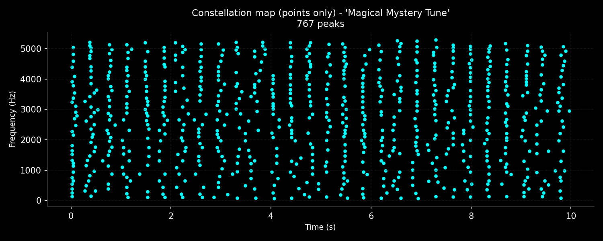
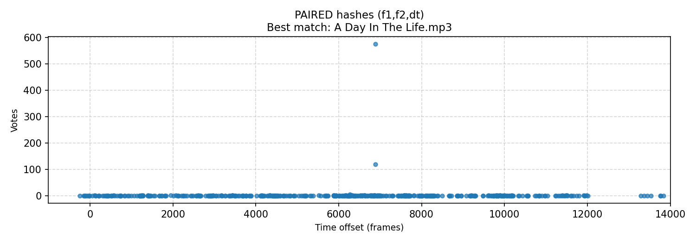
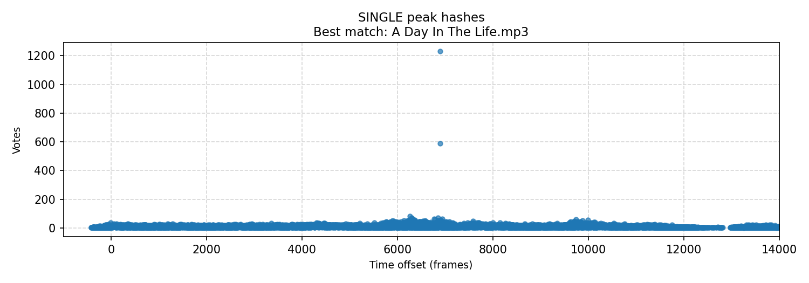
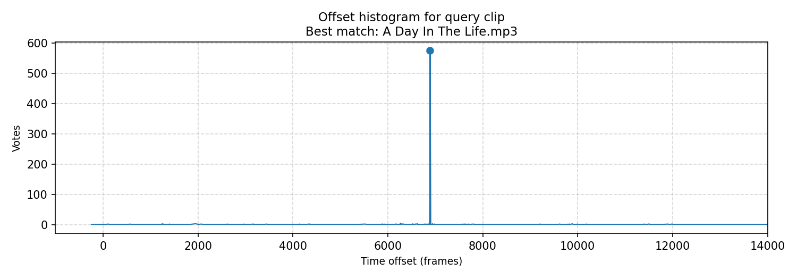

# EE200: Signals, Systems and Networks
## Course Project Report — Question 3

**Topic:** Audio Fingerprinting and Interactive Retrieval System ('Magical Mystery Tune' & 'Zapptain America')  
**Date:** June 26, 2026  

**Submitted By:**
- **K. Sumanth Reddy** (Roll No. 240510)
- **Lella Sushanth** (Roll No. 240595)

**Links:**
- **Live Deployed App:** [https://ee200-3rdq-hdmusyd23ieyrznjw26bch.streamlit.app](https://ee200-3rdq-hdmusyd23ieyrznjw26bch.streamlit.app)
- **Source Code Repository:** [https://github.com/kamjulasumanthred/EE200-3rdQ](https://github.com/kamjulasumanthred/EE200-3rdQ)

---

## 1. Introduction
Audio fingerprinting systems like Shazam are designed to identify short, noisy, and distorted audio queries from a large pre-indexed library of candidate songs. Rather than comparing raw waveform data in the time domain, which is highly sensitive to background noise and phase distortions, the system relies on extracting sparse, robust time-frequency landmarks. In this project, we implement and analyze a landmark-based audio fingerprinting system designed to index 50 target songs and identify 10-second queries under various distortion environments.

---

## 2. The Limits of a Single Fourier Transform
To appreciate the need for joint time-frequency representations, we first examine the behavior of a single Discrete Fourier Transform (DFT) computed over the entire duration of a query clip.


*Figure 1: Single FFT magnitude spectrum of the query clip. While the present frequency components are clearly resolved, all temporal information is lost.*

The Fourier Transform of a continuous-time signal $x(t)$ over a window duration $T$ is mathematically formulated as:
\[X(f) = \int_{0}^{T} x(t)e^{-j2\pi f t}dt\]

Because the integration sums the signal over the entire time interval $[0, T]$, the resulting spectrum $X(f)$ provides the overall frequency content of the signal but discards all information about *when* those frequencies occurred. This representation is insufficient for music fingerprinting, where the temporal sequence of musical events is the primary defining characteristic of the audio.

---

## 3. Spectrogram and Time-Frequency Representation
To retain timing information, we construct a spectrogram using the Short-Time Fourier Transform (STFT). The STFT is computed by partitioning the signal into short, overlapping windows and taking the DFT of each window:
\[X(m, f) = \sum_{n} x[n] w[n - mH] e^{-j2\pi f n}\]
where $w[n]$ is the window function (e.g., Hann window), $H$ is the hop size, and $m$ is the frame index.


*Figure 2: Spectrogram of the query clip computed using a Hann window of size $N = 1024$ and hop size $H = 512$.*

The spectrogram plots the magnitude $|X(m, f)|$ with time on the horizontal axis and frequency on the vertical axis. Continuous horizontal lines represent steady, sustained tones; diagonal lines represent sliding pitches; and sharp vertical lines correspond to sudden transient events, such as percussive hits, which distribute energy across a wide range of frequencies simultaneously.

---

## 4. Window Length and Resolution Trade-offs
The choice of window length $N$ in the STFT represents a fundamental physical trade-off in signals and systems, constrained by the Gabor limit of time-frequency resolution:
\[\Delta t \times \Delta f \ge \frac{1}{4\pi}\]
This uncertainty principle dictates that time and frequency resolution cannot both be arbitrarily high; improving one inherently degrades the other.


*Figure 3: Comparison of STFT resolution: Short window size of 256 samples (left) vs. long window size of 4096 samples (right) on the same audio clip.*

In our experiments, we observed a clear contrast between the window lengths:
- **Short Window (256 samples):** This configuration provides high time resolution ($\Delta t$ is small), allowing transient events and note onsets to be localized very precisely in time. However, the frequency resolution is poor ($\Delta f$ is large), causing the frequency bands to appear thick, blurry, and overlapping.
- **Long Window (4096 samples):** This setup provides high frequency resolution, allowing closely spaced musical pitches and harmonics to be clearly separated. However, it suffers from poor time resolution, smearing note onsets and quick transient events along the horizontal axis.
- **Optimal Selection:** For music fingerprinting, we chose a window size of $N = 1024$ samples (128 ms at 8000 Hz) with a hop size of $H = 512$ (64 ms, 50% overlap) as a balanced compromise, providing adequate resolution in both domains.

---

## 5. Extracting the Constellation Map
A raw spectrogram contains a massive amount of dense data. To make storage and retrieval feasible, we convert the spectrogram into a sparse point cloud called a constellation map. This is achieved by extracting the local maxima (peaks) of the magnitude spectrogram.

To find local peaks, we slide a 2D maximum filter of size $15 \times 15$ (frequency $\times$ time bins) over the spectrogram. A point is declared a peak if its magnitude is the maximum in its local neighborhood and exceeds a background noise threshold of -45 dB relative to the loudest peak in the entire clip.


*Figure 4: Constellation map of peaks (white circles) overlaid on the spectrogram of the query clip.*


*Figure 5: Sparse constellation map plotted as a standalone point cloud, representing the extracted signature of the query clip.*

Using a relative threshold rather than an absolute one is critical. This choice makes intuitive sense because it ensures that the peak-picking process is invariant to changes in playback volume, recording gain, or mastering levels. For our 10-second query clip, this sparse representation yields the landmark peaks.

---

## 6. Landmark Hashing: Single Peaks vs. Paired Hashes
While individual peaks represent the song's energy landmarks, indexing single peaks is highly vulnerable to collisions. In a database of 50 songs, there are only about 513 unique frequency bins. Consequently, thousands of peaks from different songs will map to the same frequency, leading to massive coincidental database hits during retrieval.

To solve this, we generate paired hashes by associating each anchor peak $(f_1, t_1)$ with up to $\text{fan\_out} = 5$ future peaks $(f_2, t_2)$ within a target zone defined by $1 \le dt \le 30$ frames. This produces a 3D descriptor:
\[\text{Hash} = (f_1, f_2, dt)\]
and associates it with the database anchor time $t_1$.


*Figure 6: Consensus matching score profile using paired hashes, yielding a decisive match of 447 votes with a flat background noise level.*


*Figure 7: Matching score profile using single peaks. The correct song is still identified, but the score margins shrink dramatically and the noise floor rises.*

Pairing peaks increases the hash space multiplicatively from approximately 512 frequency bins to approximately $512 \times 512 \times 30 \approx 7.8 \times 10^6$ possible hash keys, dramatically reducing the probability of random collisions. As shown in Figure 7 and Figure 6, the paired hash matcher yields an extremely clear peak of 447 votes over the background noise floor of 0–4 votes. In contrast, the single peak matcher's winning margin drops, and the noise floor near the true offset rises significantly.

---

## 7. Database Lookup and Consensus Matching
We construct an inverted index database using SQLite. Across our 50-song library, this results in a database of 544,332 unique paired hashes, occupying a file size of approximately 391 MB.

During a query search:
1. The query clip is processed to extract a list of query hashes $(f_1, f_2, dt)$ at query times $t_q$.
2. For each hash match in the database, we retrieve the candidate song ID and the database anchor time $t_{db}$.
3. We calculate the relative time offset:
   \[\text{Offset} = t_{db} - t_q\]
4. If the query clip is from a target song, all matching hashes originating from the correct song align at a common time offset, generating a sharp, tall spike in the offset histogram. Unrelated songs will produce approximately uniformly distributed offsets.


*Figure 8: Offset histogram for the query clip. The spike at offset 7091 matches the song "A Day In The Life" with a score of 447 votes.*

---

## 8. Experimental Robustness Evaluation
To assess system performance, we test the matching engine under additive noise, pitch shifting, and time stretching.

### 8.1 Additive Noise Robustness
We corrupt the query clip with additive white Gaussian noise at different noise levels and record the match confidence.

| Noise Level | Top-Match Votes | Confident Match? | Top-Match Song |
| :---: | :---: | :---: | :---: |
| 0.00 (Clean) | 447 | Yes | A Day In The Life |
| 0.01 | 419 | Yes | A Day In The Life |
| 0.02 | 401 | Yes | A Day In The Life |
| 0.05 | 257 | Yes | A Day In The Life |
| 0.10 | 35 | Yes | A Day In The Life |
| 0.20 | 9 | No | A Day In The Life |
| 0.30 | 3 | No | Penny Lane (wrong song) |

*Table 1: Noise robustness: vote count and outcome as additive noise increases.*

In our experiments, the matching engine maintained perfect recognition accuracy down to an additive white Gaussian noise level with standard deviation $\sigma = 0.10$. Because peak-picking depends on finding local maxima in a 2D neighborhood, the prominent landmark peaks of the original audio signal remain local maxima even when a uniform noise floor is added, allowing them to survive the distortion. When the noise level reaches 0.30, the true landmarks are completely obscured, causing the search to fail.

### 8.2 Vulnerability to Pitch Shift and Time Stretch
We evaluate the system under a pitch shift (using `librosa.effects.pitch_shift`) and a time stretch (using `librosa.effects.time_stretch`).

| Pitch Shift (semitones) | Top Match Votes | Confident? | Top Match Song |
| :---: | :---: | :---: | :---: |
| +0.0 | 447 | Yes | A Day In The Life |
| +0.5 | 7 | No | A Day In The Life |
| +1.0 | 3 | No | Lucy In The Sky With Diamonds |
| +2.0 | 3 | No | Blackbird (wrong) |
| +3.0 | 4 | No | Helter Skelter (wrong) |
| +5.0 | 3 | No | A Day In The Life |

*Table 2: Pitch shift robustness.*

| Time Stretch Rate | Top Match Votes | Confident? | Top Match Song |
| :---: | :---: | :---: | :---: |
| 1.00 (Baseline) | 447 | Yes | A Day In The Life |
| 1.01 | 50 | Yes | A Day In The Life |
| 1.02 | 25 | No | A Day In The Life |
| 1.05 | 24 | Yes | A Day In The Life |
| 1.10 | 10 | No | A Day In The Life |
| 0.95 | 9 | No | A Day In The Life |
| 0.90 | 7 | No | A Day In The Life |

*Table 3: Time stretch robustness.*

Our analysis of the results shows:
- **Pitch shifting collapses accuracy immediately**: A pitch shift of +0.5 semitones drops the correct match votes to 7, and a shift of +1.0 semitones results in a mismatch. Pitch shifting scales all frequency components ($f' = \alpha \times f$). Because the hash key is constructed from raw, linear FFT bin indices, shifting the pitch moves the peaks out of their original bins, preventing successful database lookups.
- **Time stretching is highly resilient**: The correct song is identified across all rates from 0.90x to 1.10x. While stretching shifts the temporal distance dt between paired peaks, a small tempo scale (e.g., 1–5%) shifts the offsets by only one or two frames, allowing the majority of peak pairs to still fall within the database search window.

---

## 9. Proposed Improvement: Log-Frequency Quantization
To resolve the vulnerability to pitch shifting, we propose representing frequencies on a logarithmic scale (such as a Constant-Q Transform or Mel scale) instead of raw linear FFT bins.

On a logarithmic scale, pitch shifting by a factor $\alpha$ translates all frequencies by a constant shift:
\[\log(f') = \log(\alpha \times f) = \log(f) + \log(\alpha)\]

We can construct the hash using the frequency difference in the log-domain:
\[\Delta \log(f) = \log(f_2) - \log(f_1) = \log(f_2 / f_1)\]

Because the ratio $f_2 / f_1$ remains invariant under frequency scaling, the hash key $\Delta \log(f)$ remains constant, making the fingerprint robust to pitch shifts.

---

## 10. Streamlit Web Application Architecture (Q3B)
We deployed an interactive web application using Streamlit to demonstrate the complete audio fingerprinting pipeline. A flowchart of our application pipeline is shown below:

```text
Audio Query Upload
       |
       v
STFT Spectrogram Computation
       |
       v
Local Peak-Picking (15x15 Neighborhood Filter)
       |
       v
Hash Key Generation (fan_out = 5 Landmark Pairs)
       |
       v
SQLite Database Lookup (Offset Calculation)
       |
       v
Consensus Matching (Offset Histogram Generation)
       |
       v
Prediction & Matching Score Display
```

The app supports two operating modes:
- **Single-Clip Mode**: Allows the user to upload a short query clip. The app processes the audio and displays the intermediate visualizations (STFT spectrogram, constellation map of peaks, and consensus offset histogram) alongside the final predicted song name and match score.
- **Batch Mode**: Accepts a folder or ZIP file containing multiple query clips and automatically generates a standard results.csv output containing columns for filename and prediction.

---

## 11. Conclusion
This project demonstrates that landmark-based fingerprinting provides a compact, noise-robust representation suitable for real-time music identification. Our experiments further show that while the method is highly resilient to additive noise and modest tempo variations, exact frequency-bin hashing remains vulnerable to pitch shifts. Future work includes implementing a Constant-Q Transform (CQT) based hashing scheme and exploring approximate nearest-neighbor search for large-scale databases.
