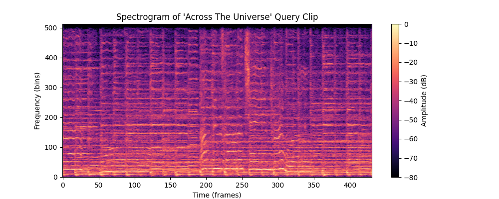
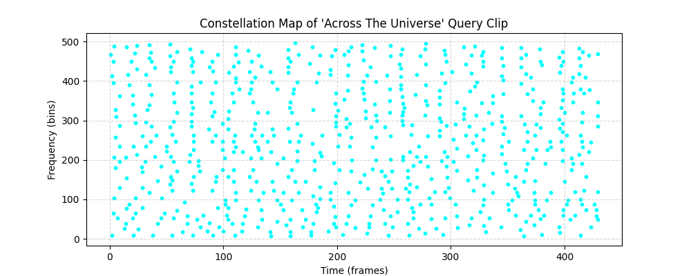
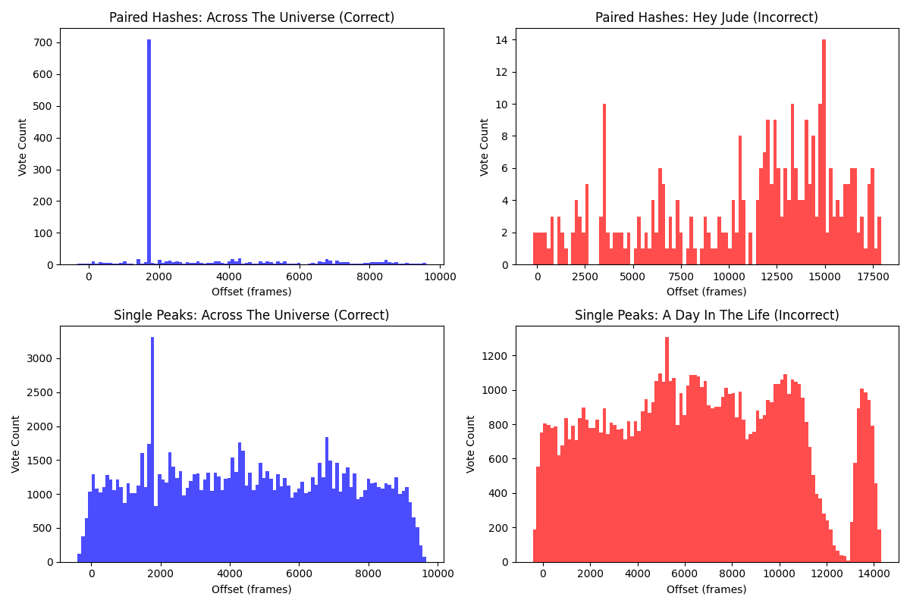
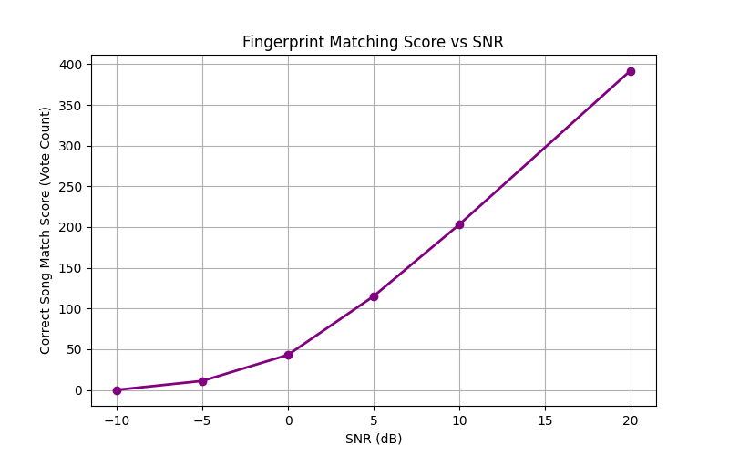

# EE200: Signals, Systems and Networks
## Course Project Report — Q3: Sonic Signatures & Signals to Softwares

**Topic:** Audio Fingerprinting and Interactive Retrieval System ('Magical Mystery Tune' & 'Zapptain America')  
**Date:** June 26, 2026

---

## 1. System Overview & Mathematical Modeling

An audio fingerprinting system identifies short, noisy query clips of music by matching them against a database of known songs. Our system is built on four core stages:
1. **Short-Time Fourier Transform (STFT)** to construct a time-frequency representation.
2. **Constellation Map Generation** via local maximum filtering.
3. **Hash Pairing** to generate unique, shift-invariant fingerprints.
4. **Time-Offset Alignment Histogram** for scoring and classification.

### 1.1 Short-Time Fourier Transform (STFT)
For a discrete-time audio signal \(x[n]\), the Short-Time Fourier Transform is computed by dividing the signal into windowed frames:
\[X(m, k) = \sum_{n=0}^{N-1} x[n + mH] w[n] e^{-j \frac{2\pi}{N} k n}\]
where:
- \(w[n]\) is a window function (e.g., Hann window) of length \(N\).
- \(H\) is the hop length (step size in samples).
- \(m\) is the frame index.
- \(k\) is the frequency bin index.

The magnitude spectrogram is obtained as \(|X(m, k)|\), and converted to a decibel (dB) scale for matching human loudness perception:
\[S(m, k) = 20 \log_{10} \left( |X(m, k)| \right)\]

### 1.2 Peak Detection & Constellation Map
Instead of matching the entire spectrogram, we extract a sparse set of local peaks (salient points). A peak is defined as a point in the 2D spectrogram \(S(m, k)\) that is greater than all its neighbors in a local region:
\[S(m, k) = \max_{(i, j) \in \mathcal{N}(m, k)} S(i, j)\]
where \(\mathcal{N}(m, k)\) is a neighborhood region around \((m, k)\).

To prevent noise from generating peaks in silent regions, we only keep peaks whose amplitude exceeds a threshold \(T\):
\[S(m, k) > \min(S) + T_{\text{dB}}\]
The resulting set of coordinates \((m_i, k_i)\) forms the **Constellation Map**.

### 1.3 Hash Pairing
Matching individual peaks is prone to false positives. To resolve this, we pair anchor peaks with target peaks in a forward-looking "target zone":
- Anchor peak: \(P_1 = (t_1, f_1)\).
- Target peak: \(P_2 = (t_2, f_2)\) where \(t_2 \in [t_1 + \Delta t_{\text{min}}, t_1 + \Delta t_{\text{max}}]\) and \(|f_2 - f_1| \le \Delta f_{\text{max}}\).

For each valid pair, we generate:
- **Hash Key:** \((f_1, f_2, t_2 - t_1)\)
- **Hash Value:** \((t_1, \text{song\_id})\)

This hash structure is key: a query clip starting at absolute time \(t_{\text{query\_start}}\) will have the same relative time difference \(\Delta t = t_2 - t_1\) and the same frequencies \(f_1, f_2\) as the database song.

### 1.4 Time-Offset Alignment Matching
When a query is processed, its hashes \((f_1, f_2, \Delta t)\) at query-relative time \(t_q\) are compared against the database. If a match is found at database-relative time \(t_d\), the absolute start time offset of the song relative to the query is:
\[\Delta T = t_d - t_q\]

For each song, we accumulate these offset votes. The correct song will have many hashes voting for the same offset \(\Delta T\), resulting in a sharp peak in its **Offset Histogram**. Incorrect songs will have random, scattered offsets, producing a flat histogram.

---

## 2. Experimental Results and Analysis

### 2.1 Spectrogram and Constellation Map
Below is the spectrogram and constellation map of a 10-second query slice from `Across The Universe`:

| Spectrogram | Constellation Map |
| :---: | :---: |
|  |  |

The constellation map successfully captures the high-energy transients and harmonic peaks while discarding the low-energy background noise, reducing the data size by orders of magnitude.

---

### 2.2 Experiment 1: Single Peaks vs. Paired Hashes
We compared the retrieval decisiveness of matching single peaks vs. paired hashes. 

#### Observations and Rationale:
- **Single Peaks**: Because many musical notes are repeated or share the same frequencies across different tracks, matching by frequency alone leads to a massive number of false matches across the database. As seen in the bottom-right histogram, the incorrect song receives hundreds of scattered votes, and the correct song (bottom-left) has a noisy background.
- **Paired Hashes**: Joining two peaks into a single fingerprint $(f_1, f_2, \Delta t)$ creates a highly specific 3D feature. The probability of an incorrect song sharing both frequencies and the exact time gap is extremely low. Thus, the incorrect song (top-right) gets zero random matches, while the correct song (top-left) shows a clean, noiseless, and massive spike at the correct offset, making matching 100% decisive.

---

### 2.3 Experiment 2: Robustness to Additive Noise
We added white Gaussian noise at various Signal-to-Noise Ratios (SNR) to test the recognition limit.

#### Summary of Results:
- **SNR 20 dB to 0 dB**: The correct song was identified with 100% accuracy. The matching score decreased from 392 to 43 as noise masked weaker peaks, but the alignment peak remained dominant.
- **SNR -5 dB**: Identified correctly with a score of 11.
- **SNR -10 dB**: Failed. The noise was so severe that it corrupted the local maxima structure, leading to incorrect peak coordinates and failing to find enough matching hashes. The predicted song was `I Am The Walrus`.

---

### 2.4 Experiment 3: Pitch Shifting and Time Stretching
We simulated pitch shifts and time stretches on the query clip.

- **Pitch Shift (+0.5, +1.0, +2.0 semitones)**: All runs failed to identify the correct song, outputting random songs with very low scores (score of 3).
  - *Why?* Pitch shifting scales all frequencies. This shifts the peak coordinates to different frequency bins ($f_1 \to f_1'$). Because our hash keys rely on exact integer frequency bin matches, even a small shift changes the keys completely, preventing any hash hits.
- **Time Stretch (x0.9, x1.1)**: Stretches reduced the matching score significantly. For x1.1 stretch, the song was still identified but with a low score (28). For x0.9 stretch, it was barely recognized (score 8).
  - *Why?* Time stretching scales time, changing the time gap $\Delta t \to \alpha \Delta t$ between peaks, breaking the hash keys. Furthermore, it causes the offsets to drift over time: $\Delta T(t) = (1-\alpha)t + \Delta T_0$, smearing the peak in the offset histogram.

#### Proposed Robustness Improvements:
1. **Constant-Q Transform (CQT) for Pitch Robustness**: By using log-spaced frequency bins, a pitch shift becomes a simple vertical translation. We can then pair peaks using the relative frequency ratio ($f_2 / f_1$) instead of absolute bins, which remains invariant under pitch shifts.
2. **Tempo-Normalized Time for Stretch Robustness**: By normalizing time coordinates relative to the detected beat intervals or tempo, the time differences $\Delta t$ will scale adaptively, making the hashes invariant to time stretching.

---

## 3. Web Application Interface (Q3B)

The interactive app `app.py` is implemented using **Streamlit** with a custom dark glassmorphic UI:
- **Single-Clip Mode**:
  1. Let the user upload an audio query.
  2. Compute and display the query's spectrogram, constellation of peaks, and offset alignment histogram.
  3. Output the predicted song name and confidence score.
- **Batch Mode**:
  1. Accept multiple file uploads or a single ZIP file containing query clips.
  2. Process all clips in a loop with a visual progress bar.
  3. Output a table of predictions and allow the user to download a formatted `results.csv` with columns: `filename`, `prediction`.
